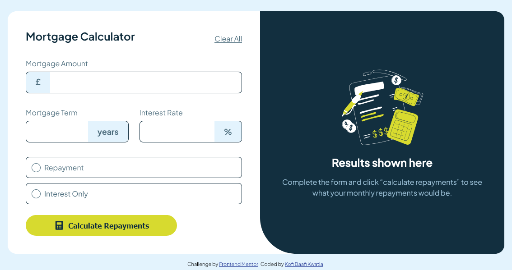

# Frontend Mentor - Mortgage repayment calculator solution

This is a solution to the [Mortgage repayment calculator challenge on Frontend Mentor](https://www.frontendmentor.io/challenges/mortgage-repayment-calculator-Galx1LXK73). Frontend Mentor challenges help you improve your coding skills by building realistic projects.

## Table of contents

- [Overview](#overview)
  - [The challenge](#the-challenge)
  - [Screenshot](#screenshot)
  - [Links](#links)
- [My process](#my-process)
  - [Built with](#built-with)
  - [What I learned](#what-i-learned)
  - [Continued development](#continued-development)
  - [Useful resources](#useful-resources)
- [Author](#author)

**Note: Delete this note and update the table of contents based on what sections you keep.**

## Overview

The Mortgage Repayment Calculator is a web application that allows users to input mortgage details such as the loan amount, interest rate, and term length. Upon submitting the form, the application calculates and displays the monthly repayment and total repayment amounts. The project ensures that the form validation is user-friendly, enabling completion using only the keyboard and providing clear validation messages for any incomplete fields.

### The challenge

Users should be able to:

- Input mortgage information and see monthly repayment and total repayment amounts after submitting the form
- See form validation messages if any field is incomplete
- Complete the form only using their keyboard
- View the optimal layout for the interface depending on their device's screen size
- See hover and focus states for all interactive elements on the page

### Screenshot



### Links

- Solution URL: [GitHub](https://github.com/WesSno/mortgage-repayment-calculator-main)
- Live Site URL: [Netlify](https://wes-mortgage-repayment-calculator.netlify.app/)

## My process

- I started with HTML5 markup to give the web app its skeleton.
- I moved on to CSS, where I used its custom propertied and flexbox to give the skeleton an eye-pleasing flesh.
- I used vanilla JavaScript to give the web app some functionality to enhance user experience.
  - I researched thoroughly about JavaScript form validation on sites like stackoverflow and W3chools.

### Built with

- Semantic HTML5 markup
- CSS custom properties
- Flexbox
- Mobile-first workflow
- Vanilla JavaScript

### What I learned

I learnt about the adjacent sibling combinator and pseudo elements such as **::before** and **:focus-within**.

```css
#mortgage-amount:focus + .input-prefix,
#mortgage-term:focus + .input-suffix,
#interest-rate:focus + .input-suffix {
  background-color: var(--lime);
}

.repayment-button:focus-within,
.interest-only-button:focus-within {
  border-color: var(--lime);
  background-color: var(--very-light-red);
}

input[type="radio"]:checked + span::before {
  background-color: var(--lime);
  border-color: var(--lime);
}
```

If you want more help with writing markdown, we'd recommend checking out [The Markdown Guide](https://www.markdownguide.org/) to learn more.

### Continued development

I want to continue developing my skills in:

- CSS pseudo-elements
- Vanilla JavaScript
- React

### Useful resources

- [The Markdown Guide](https://www.markdownguide.org/) - This guide helped me understand markdown better and improve the documentation.
- [W3Schools](https://www.w3schools.com/js/js_validation.asp) - This site helped me understand JavaScript form validation.

## Author

- Frontend Mentor - [@WesSno](https://www.frontendmentor.io/profile/WesSno)
- GitHub - [@WesSno](https://github.com/WesSno)
